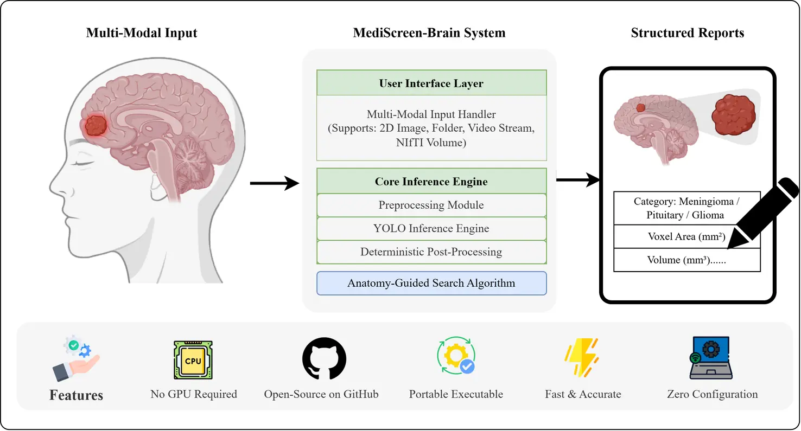
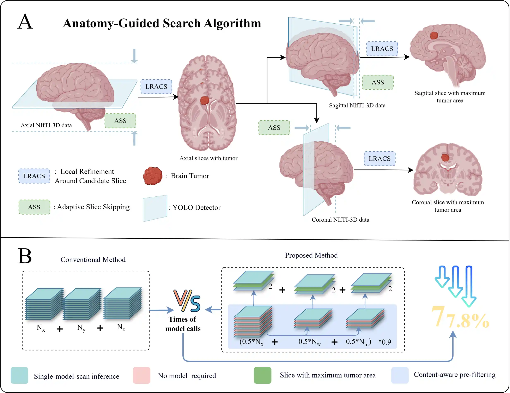

# [MediScreen-Brain](https://jingw-ui.github.io/MediScreen-Brain/)

> A YOLO-Based, CPU-Optimized GUI Platform for Brain Tumor Detection and Reporting

MediScreen-Brain is a lightweight brain-tumor detection system designed for both clinical and research applications. It integrates YOLO object-detection models with CPU-optimized inference and a PySide6 graphical interface, enabling non-experts to analyze medical images and generate structured reports efficiently.


## ✨ Key Features

- **Medical Imaging** — Parse 3D MRI NIfTI files (`.nii` / `.nii.gz`), auto-generate axial / sagittal / coronal views, locate tumors and measure size & volume.
- **Real-time & Batch** — Real-time detection for single images, videos and cameras; folder-level batch analysis with automatic Excel & PDF diagnostic reports.
- **Multi-Camera Monitor** — Monitor up to 4 cameras in real time, auto-capture snapshots on detection, with playback & export.
- **Format Conversion** — Convert NIfTI volumes to PNG slice sequences with multi-direction export and preview for downstream visualization.

## 🔄 System Workflow



## 🧠 Algorithm Architecture



A YOLO deep-learning-driven medical imaging pipeline: input → preprocessing → YOLO inference → tumor localization & measurement → structured report.

## 🖥️ Interface Demo

Live interactive demos (with playable videos) are available on the **[project page](https://jingw-ui.github.io/MediScreen-Brain/#demo)**. Source clips are included under [`assets/video/`](assets/video):

- **Single Image Detection** — `single_image_converted.mp4`
- **Batch Processing Results** — `Batch_results_converted.mp4`
- **NIfTI 3D Analysis** — `NifTi_converted.mp4`
- **Format Conversion Tool** — `conversion_converted.mp4`

## 🛠️ Tech Stack

| Layer | Technology |
| --- | --- |
| Core framework | Python 3.8+, Ultralytics YOLOv8, PySide6 GUI, OpenCV |
| Medical imaging | NiBabel (NIfTI `.nii` / `.nii.gz`), intelligent 3D slice extraction |
| Reporting | openpyxl (Excel), ReportLab (PDF) |
| 3D visualization | PyVista / VTK |

## 🚀 Getting Started

### Option 1 — Download the desktop app

Lightweight & portable · instant launch · zero configuration.

⬇ [Download MediScreen-Brain v1.0.3 (.exe)](https://github.com/JingW-ui/MediScreen-Brain/releases/download/MediScreen-Brain/MediScreen-Brain_1.0.3.exe)

See all releases: [MediScreen-Brain releases](https://github.com/JingW-ui/MediScreen-Brain/releases/tag/MediScreen-Brain)

### Option 2 — Run from source

```bash
git clone https://github.com/JingW-ui/MediScreen-Brain.git
cd MediScreen-Brain
pip install -r requirements.txt
python Brain_Tumor_detection_ui.py
```

> Requires Python 3.8+. A CUDA-capable GPU is optional — inference is optimized to run on CPU.

## 📚 Documentation

- 📄 [Project Documentation (English)](doc/PROJECT_DOCUMENTATION_EN.md)
- 📄 [项目文档 (中文)](doc/PROJECT_DOCUMENTATION_ZN.md)
- 📝 [Release Notes v1.0.3](doc/RELEASE_NOTES_v1.0.3_EN.md)

## 📖 Citation

If you use this software in your research, please cite our paper:

> Jing W, et al. (2026). *MediScreen-Brain: A Portable, YOLO-powered GUI for Multi-Modal Brain Tumor Detection, 3D Localization, and Structured Reporting*. Computer Methods and Programs in Biomedicine. (DOI: not published yet)

## 💬 Contact

Questions, bug reports and collaboration ideas are welcome via [GitHub Issues](https://github.com/JingW-ui/MediScreen-Brain/issues).

## 📄 License

This project is licensed under the **MIT License**. See the [LICENSE](LICENSE) file for details.

---

© 2026 MediScreen-Brain · For research & education only.
